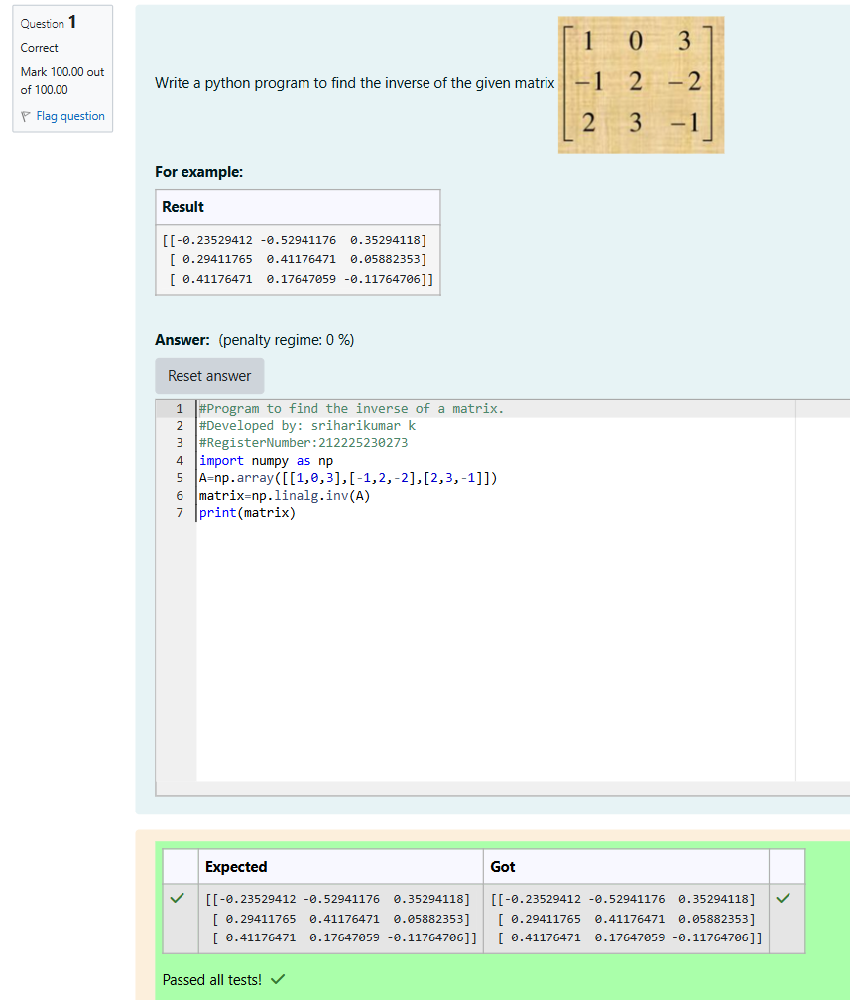

# INVERSE-OF-A-MATRIX
## Aim:
To write a python program to find the inverse of a matrix
## Equipment’s required:
1. 	Hardware – PCs
2. 	Anaconda – Python 3.7 Installation / Moodle-Code Runner
## Algorithm:
### Step1 :  Import the numpy module to use the built-in functions for calculation
### Step 2: Prepare the lists from the given matrix values and assign in np.array()
### Step 3:  Using the np.linalg.inv(), we can find the inverse of the given matrix.and store in variable
### Step 4: print the variable and it prints the inverse of given matrix
### step 5: End the program

## Program:
```
#Program to find the inverse of a matrix.
#Developed by: sriharikumar k
#RegisterNumber:212225230273
import numpy as np
A=np.array([[1,0,3],[-1,2,-2],[2,3,-1]])
matrix=np.linalg.inv(A)
print(matrix)
```
## Output:

## Result:
Thus the inverse of given matrix is successfully solved using python program

